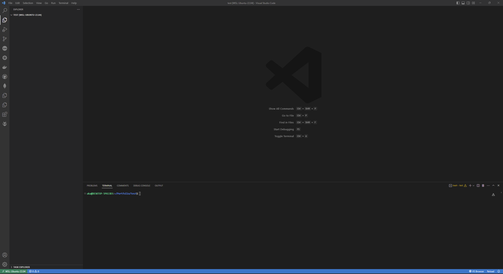
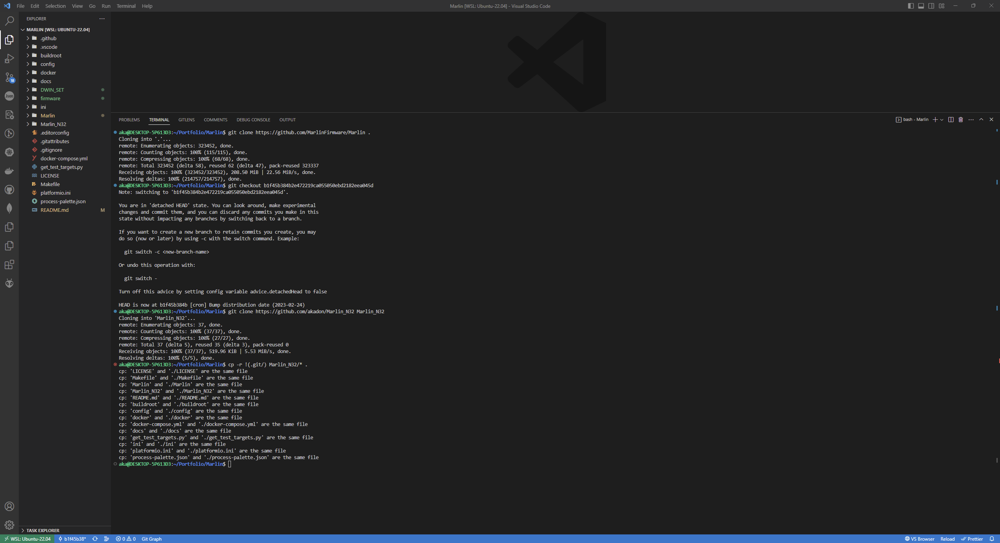
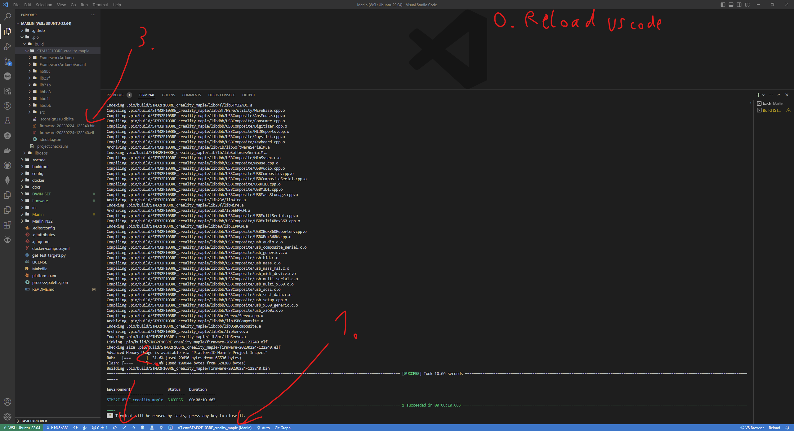

instaltion:
per hand:
just copy my github https://github.com/akadon/N32_Voxelab_Marlin into https://github.com/MarlinFirmware/Marlin.
  
Linux:     
git clone https://github.com/MarlinFirmware/Marlin .   
git checkout b1f45b384b2e472219ca055050ebd2182eea045d # latest commit at this time (tested works)   
git clone https://github.com/akadon/Marlin_N32 Marlin_N32   
cp -r !(.git/*) Marlin_N32/* .    
  
Dont forget to change platform to STM32F103RE_creality_maple  

picture guide:

